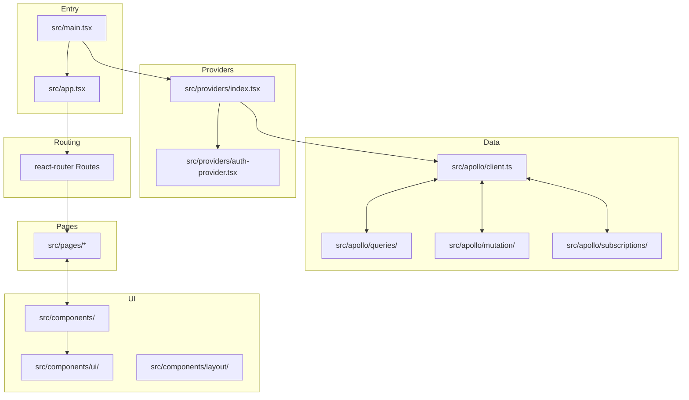
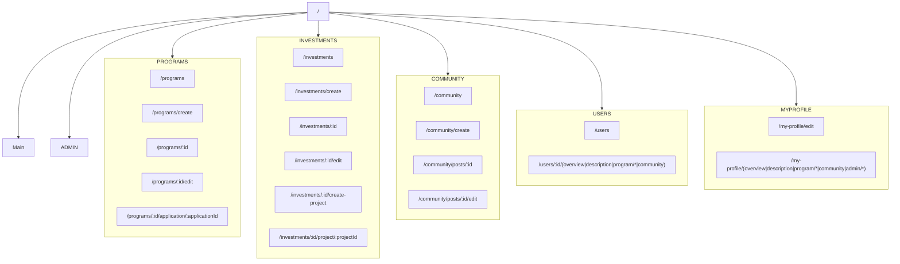
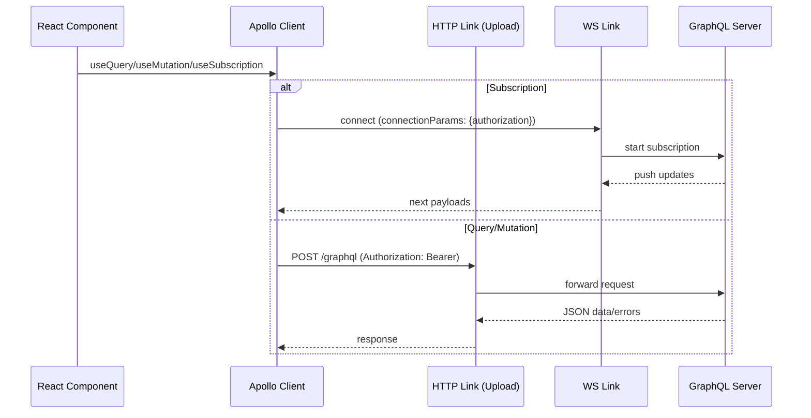
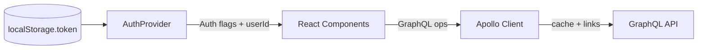

# Ludium Portal Architecture Documentation

## Table of Contents
- [Introduction](#introduction)
- [Project Architecture](#project-architecture)
- [Technology Stack](#technology-stack)
- [Folder and File Structure](#folder-and-file-structure)
- [Core Modules and Components](#core-modules-and-components)
- [Navigation and Routing](#navigation-and-routing)
- [API Layer](#api-layer)
- [State Management](#state-management)
- [Custom Hooks and Utilities](#custom-hooks-and-utilities)
- [UI and UX Layer](#ui-and-ux-layer)
- [Setup and Run Instructions](#setup-and-run-instructions)
- [Extension and Scalability](#extension-and-scalability)
- [Best Practices](#best-practices)
- [Conclusion](#conclusion)

## Introduction
The Ludium Portal is a React + TypeScript single-page application that enables users to explore programs, apply to them, invest in projects, and participate in community discussions. It integrates with a GraphQL backend and on-chain wallets to deliver a cohesive experience for builders, validators, sponsors, and admins.

Primary goals:
- Provide a modern, responsive UI with clear navigation across Programs, Investments, Community, and User profiles.
- Offer secure authentication and wallet integration for user onboarding and transactions.
- Deliver real-time updates via GraphQL subscriptions and robust data fetching with Apollo Client.

Key features:
- Role-aware navigation and admin tooling.
- Programs and applications management with nested routes.
- Investments and project details with creation and edit flows.
- Community posts, user directories, and profile management.
- Real-time data through subscriptions and secure file uploads via GraphQL.

## Project Architecture
The app follows a modular architecture with clear boundaries between presentation, routing, data access, providers, and domain pages.



## Technology Stack
- React 18, React DOM
- TypeScript 5
- Vite 6 (build, dev, preview)
- React Router 7 (SPA routing)
- Apollo Client 3 (GraphQL queries, mutations, subscriptions)
- graphql-ws + apollo-upload-client (subscriptions & file uploads)
- TailwindCSS 4 + tailwind-merge + tailwindcss-animate
- Radix UI primitives + shadcn/ui-style components in `src/components/ui`
- React Hook Form for forms
- Lucide React icons
- date-fns for date utilities
- Privy for authentication and smart wallets, viem chains configuration

Dev tooling:
- Biome for lint/format/check
- GraphQL Code Generator for typed operations
- Vite SVGR plugin for SVGs

## Folder and File Structure
High-level directories under `src/` and their roles:
- `app.tsx`: App-level routes and layout composition.
- `main.tsx`: App bootstrap, mounts React root and wraps with providers.
- `providers/`: Cross-cutting providers.
  - `index.tsx`: Composes `ApolloProvider`, `BrowserRouter`, `AuthProvider`, `PrivyProvider`, and `SmartWalletsProvider`.
  - `auth-provider.tsx`: Auth context, token storage, profile fetch, and role flags.
- `apollo/`: GraphQL client and generated operations.
  - `client.ts`: HTTP upload link, WS link, auth middleware, link split, cache.
  - `queries/`, `mutation/`, `subscriptions/`: Codegen outputs and colocated operation hooks.
- `components/`: Reusable UI and domain components.
  - `layout/`: Global layout, admin outlet.
  - `ui/`: Button, Dialog, Table, Tabs, etc. built on Radix primitives.
  - Other domain components: `investment-card.tsx`, forms, markdown, notifications.
- `pages/`: Route-bound feature pages (Programs, Investments, Community, Users, Admin, Profile).
- `assets/`: Static assets.
- `constant/`, `lib/`, `types/`: Constants, utilities, and generated GraphQL types.

Example tree (abridged):
```text
src/
  app.tsx
  main.tsx
  apollo/
    client.ts
    queries/
    mutation/
    subscriptions/
  providers/
    index.tsx
    auth-provider.tsx
  components/
    layout/
    ui/
    investment-card.tsx
  pages/
    programs/
    investments/
    community/
    profile/
    admin/
```

## Core Modules and Components
- `providers/index.tsx`: Wraps the app with Apollo, Router, Auth, Privy, and Smart Wallets. Sets default chain, supported chains, wallet list, and login methods.
- `providers/auth-provider.tsx`: Supplies `AuthContext` with token, email, role flags, and `login`/`logout`. Fetches `profile` via `useProfileQuery`, persists token in `localStorage`, and adds `Bearer` auth via Apollo link middleware.
- `apollo/client.ts`: Configures HTTP upload link to `${VITE_SERVER_URL}/graphql`, WS link to `${VITE_SERVER_WS_URL}` with infinite retries and exponential-ish jitter, and splits links by operation type. Sets `network-only` fetch policies.
- `components/ui/*`: Shadcn-style, Radix-based primitives (Button, Dialog, Table, Tabs, Form inputs) styled with Tailwind.
- `components/layout/*`: Application shell, headers, sidebars, `AdminOutlet` for admin-only areas.

## Navigation and Routing
Routing is declared in `app.tsx` using React Router 7. The structure below omits some nested details for brevity.



Minimal example of nested routes in `app.tsx`:
```tsx
<Routes>
  <Route path="/" element={<Layout />}>
    <Route index element={<MainPage />} />
    <Route path="programs">
      <Route index element={<ProgramsPage />} />
      <Route path=":id" element={<ProgramDetailsPage />} />
    </Route>
  </Route>
</Routes>
```

## API Layer
The API layer uses Apollo Client with both HTTP uploads and WebSocket subscriptions.

- HTTP link: `apollo-upload-client` to `${VITE_SERVER_URL}/graphql` with `Apollo-Require-Preflight` header for CORS and file uploads.
- WS link: `graphql-ws` to `${VITE_SERVER_WS_URL}`, sends `authorization` from `localStorage` token in `connectionParams`, retries indefinitely with jitter.
- Auth middleware: Injects `Authorization: Bearer <token>` on every HTTP request.
- Link split: Subscriptions go over WS; queries/mutations go over HTTP.
- Codegen: `graphql-codegen` generates typed hooks in `src/apollo/queries` and `src/apollo/mutation` consumed like `useProfileQuery`, `useLoginMutation`.



## State Management
Global server state is managed by Apollo Client cache with `network-only` fetch policies to prioritize freshness. Auth state is stored in `AuthContext` and persisted via `localStorage` token.



Notes:
- Role flags (`isAdmin`, `isSuperadmin`) are derived from `profile.role` via `useProfileQuery` when a token exists.
- On auth error, `AuthProvider` triggers `logout()` and navigates home.

## Custom Hooks and Utilities
- Generated GraphQL hooks: `useProfileQuery`, `useLoginMutation`, and others under `src/apollo/*/`. These are typed via codegen and consumed directly in components/pages.
- Utilities and constants exist under `lib/` and `constant/` (consult files for specifics). If a particular helper is missing, consider adding it to `lib/` with unit-testable functions.

Assumption: No custom global state library (Redux/Zustand) is used; Apollo + React Context cover data and auth. If Redux/Zustand exists elsewhere, integrate it at `providers/index.tsx` similarly to `AuthProvider`.

## UI and UX Layer
- TailwindCSS 4 for styling with utility classes.
- `src/components/ui/` contains composable primitives (Button, Dialog, Input, Table, Tabs, etc.) built on Radix components.
- Domain components like `investment-card.tsx` encapsulate feature-specific UI.
- Layout components handle global chrome (`Layout`, `AdminOutlet`, sidebars, headers).

Example button usage:
```tsx
import { Button } from '@/components/ui/button';

export const SaveAction = () => (
  <Button type="submit" className="w-full md:w-auto">Save</Button>
);
```

## Setup and Run Instructions
Prerequisites:
- Node.js 22+ recommended
- pnpm, npm, or yarn
- Environment variables:
  - `VITE_SERVER_URL` (e.g., `https://api.example.com`)
  - `VITE_SERVER_WS_URL` (e.g., `wss://api.example.com/graphql`)
  - `VITE_PRIVY_APP_ID`

Scripts:
- `pnpm dev` or `npm run dev`: Start Vite dev server.
- `pnpm build` or `npm run build`: Type-check and build for production.
- `pnpm preview` or `npm run preview`: Preview the production build.
- `pnpm lint` / `pnpm format` / `pnpm check`: Lint/format with Biome.

Steps:
1. Install deps: `pnpm install`
2. Create `.env` with required variables.
3. Run dev server: `pnpm dev`
4. Open app at the printed local URL.